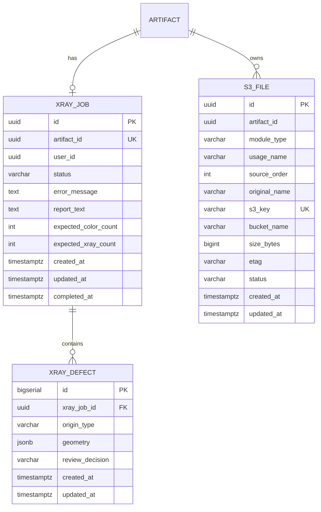
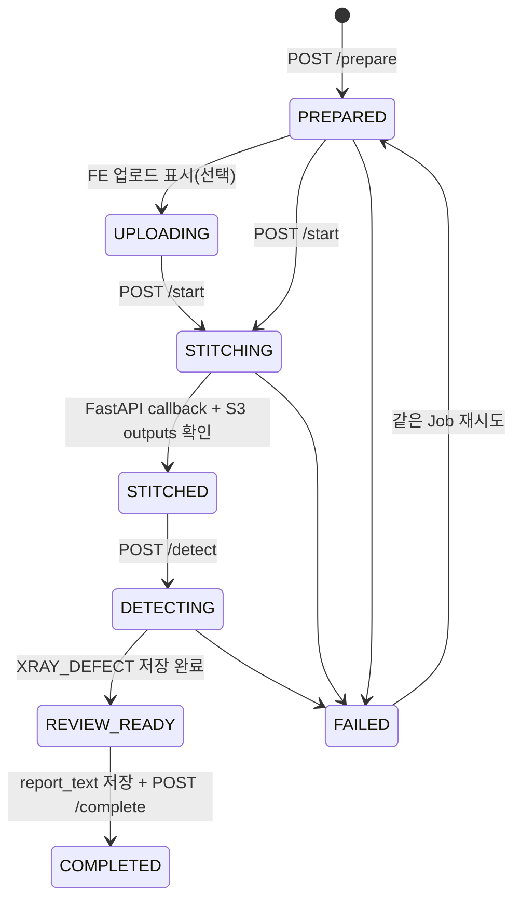

# X-RAY 파트 최종 구조 정리

> 범위: X-RAY 파트 전용 구조
> 
> 현재 ARTIFACT API는 복원 가이드·육안 조사 통합 이후 구현한다. 그전까지 FE local/session에서 전달하던 `artifactId(UUID)`를 그대로 사용한다.

---

## 0. 핵심 결정사항

- 서비스 기준 식별자는 `artifactId`이다.
- X-RAY 내부 전체 업무 상태는 `jobId`로 추적한다.
- `ARTIFACT : XRAY_JOB = 1 : 0..1` 정책을 적용한다.
- 현재는 ARTIFACT 테이블 FK를 걸지 않고 `artifact_id UNIQUE`만 적용한다.
- 사용자 통합 전까지 `user_id`는 nullable이다.
- 이미지·JSON·ZIP 산출물의 정본은 S3이다.
- RDS에는 반복 조회·수정하는 `XRAY_JOB`, `XRAY_DEFECT`, 공용 `S3_FILE`만 저장한다.
- 원시 AI 탐지 결과와 매핑 중간 결과는 필요 시 S3 JSON으로 보존한다.
- 기존 FE multipart API는 당분간 유지한다.

---

## 1. 전체 ERD



현재 단계에서는 `ARTIFACT`와 `USER` FK는 보류한다. 통합 API가 완성되면 FK만 추가하고 X-RAY API 계약은 유지한다.

---

# 2. XRAY_JOB

## 2.1 용도

유물 하나에 대한 X-RAY 전체 업무 상태를 관리한다.

```text
업로드 준비
→ 자동 결합
→ Konva 최종 배치
→ 결함 탐지/매핑
→ 전문가 DAMAGE/NORMAL 검수
→ 문안 확정
→ 완료
```

`jobId`는 자동 결합 실행 한 번만 의미하지 않는다. 유물 하나의 X-RAY 파트 전체 업무를 추적하는 ID이다.

## 2.2 컬럼

| 컬럼 | 타입 | 제약 | 설명 |
|---|---|---|---|
| `id` | uuid | PK | API에서 사용하는 `jobId` |
| `artifact_id` | uuid | UNIQUE | FE local/session에서 전달받는 유물 UUID. 추후 ARTIFACT FK |
| `user_id` | uuid | nullable | 추후 인증 사용자 FK |
| `status` | varchar(20) | NOT NULL | X-RAY 전체 업무 상태 |
| `error_message` | text |  | 실패 원인. 정상 상태는 NULL |
| `report_text` | text |  | 전문가가 최종 확정한 X-RAY 상태조사 문안 |
| `expected_color_count` | int | NOT NULL | `/prepare` 당시 예상 컬러 이미지 수 |
| `expected_xray_count` | int | NOT NULL | `/prepare` 당시 예상 X-RAY 원본 수 |
| `created_at` | timestamptz | NOT NULL | 작업 생성 시각 |
| `updated_at` | timestamptz | NOT NULL | 상태·문안 마지막 변경 시각 |
| `completed_at` | timestamptz |  | X-RAY 파트 전체 완료 시각 |

## 2.3 상태

```text
PREPARED
UPLOADING
STITCHING
STITCHED
DETECTING
REVIEW_READY
COMPLETED
FAILED
```

### 상태 전환



### 현재 정책

- 유물당 Job 1개이므로 실패 후 새 Job을 만들지 않고 같은 Job을 재사용한다.
- `/prepare`를 다시 호출하면 FAILED/PREPARED Job의 Presigned URL을 재발급한다.
- `report_text`가 저장되어야 `/complete`가 가능하다.
- `UPLOADING`은 FE 진행률 표시용 예약 상태이며, 현재 서버 API는 `PREPARED → STITCHING`으로 바로 진행할 수 있다.

## 2.4 API

### 기존 유지

| Method | Path | 설명 |
|---|---|---|
| POST | `/api/xray/stitch/jobs/prepare` | XRAY_JOB 생성/재사용 및 입력 Presigned PUT URL 발급 |
| POST | `/api/xray/stitch/jobs/{jobId}/start` | 자동 결합 시작 |
| GET | `/api/xray/stitch/jobs/{jobId}` | 전체 상태 polling |
| GET | `/api/xray/stitch/jobs/{jobId}/result` | 자동 결합 이미지 조회 |
| GET | `/api/xray/stitch/jobs/{jobId}/layout` | 자동 layout 조회 |
| POST | `/api/xray/stitch/callback` | FastAPI 내부 callback |
| PUT | `/api/xray/stitch/jobs/{jobId}/layout/final` | Konva 최종 transform 저장 및 Finalizer 실행 |
| GET | `/api/xray/stitch/jobs/{jobId}/layout/final` | 최종 layout 조회 |
| POST | `/api/xray/stitch/jobs` | 기존 FE multipart 호환 API |

### 신규 통합 API

| Method | Path | 설명 |
|---|---|---|
| POST | `/api/xray/jobs/{jobId}/detect` | 원본+결합본 탐지, 좌표변환, 매핑, 중복통합, XRAY_DEFECT 생성 |
| GET | `/api/xray/jobs/{jobId}/defects` | 최종 이미지 URL 및 결함 목록 조회 |
| PUT | `/api/xray/jobs/{jobId}/defects` | DAMAGE/NORMAL 판정 변경 |
| POST | `/api/xray/jobs/{jobId}/report-text/generate` | DAMAGE 결함으로 문안 초안 생성 |
| GET | `/api/xray/jobs/{jobId}/report-text` | 저장된 최종 문안 조회 |
| PUT | `/api/xray/jobs/{jobId}/report-text` | 전문가 수정·확정 문안 저장 |
| POST | `/api/xray/jobs/{jobId}/complete` | 최종 완료 및 `defect_result.png` 생성 |

---

# 3. XRAY_DEFECT

## 3.1 용도

원본 조각 탐지와 최종 결합본 탐지를 최종 이미지 좌표계로 변환하고, 매핑·중복통합한 최종 결함 한 건당 한 행을 저장한다.

```text
XRAY_JOB 1 : N XRAY_DEFECT
```

## 3.2 컬럼

| 컬럼 | 타입 | 제약 | 설명 |
|---|---|---|---|
| `id` | bigserial | PK | FE에서 판정 변경 시 사용하는 결함 ID |
| `xray_job_id` | uuid | FK | XRAY_JOB 참조 |
| `origin_type` | varchar(20) | NOT NULL | 결함 생성 근거 |
| `geometry` | jsonb | NOT NULL | `assembled_xray.final.png` 기준 최종 좌표 |
| `review_decision` | varchar(20) | NOT NULL | 전문가 최종 판정. 기본 DAMAGE |
| `created_at` | timestamptz | NOT NULL | 최종 결함 생성 시각 |
| `updated_at` | timestamptz | NOT NULL | 전문가 판정 변경 시각 |

## 3.3 origin_type

```text
MATCHED
SOURCE_ONLY
ASSEMBLED_ONLY
```

- `MATCHED`: 원본과 최종 결합본 양쪽에서 대응됨
- `SOURCE_ONLY`: 원본에서는 검출됐지만 결합본 탐지와 대응되지 않음
- `ASSEMBLED_ONLY`: 최종 결합본에서만 검출됨

## 3.4 review_decision

```text
DAMAGE
NORMAL
```

- INSERT 시 기본값은 `DAMAGE`
- 전문가는 오탐만 `NORMAL`로 제외
- 문안 생성과 최종 결함 이미지는 `DAMAGE`만 사용

## 3.5 geometry

현재는 bbox를 저장한다.

```json
{
  "type": "bbox",
  "x1": 320.4,
  "y1": 151.8,
  "x2": 495.2,
  "y2": 327.1
}
```

향후 polygon이 필요하면 동일 JSONB 컬럼에서 확장한다.

### 현재 제외 컬럼

- `class_name`: 현재 모델이 anomaly 단일 클래스라 정보 가치가 낮음
- `position`, `area_ratio_percent`: geometry와 이미지 크기로 계산 가능
- `user_note`, `confirmed_by`, `confirmed_at`: 현재 UX에 없음
- 원시 Region 및 매핑 중간 결과: RDS가 아닌 S3 JSON으로 보존 가능

---

# 4. S3_FILE usage 규칙

| usage_name | 실제 파일 | 설명 |
|---|---|---|
| `color_reference` | `inputs/color/*` | 컬러 기준 이미지 |
| `xray_original` | `inputs/xray/*` | 원본 X-RAY. `source_order` 필수 |
| `assembled_auto` | `assembled_xray.png` | 자동 결합 이미지 |
| `layout_auto` | `layout.json` | 자동 배치 정보 |
| `layout_fragment_masks` | `layout_fragment_masks.zip` | Finalizer 필수 intermediate |
| `layout_final` | `layout.final.json` | Konva 최종 배치 |
| `assembled_final` | `assembled_xray.final.png` | 최종 결합 이미지 |
| `source_owner` | `source_owner.final.png` | 매핑용 provenance |
| `fragment_owner` | `fragment_owner.final.png` | fragment provenance |
| `seam_zone` | `seam_zone.final.png` | seam 영향 확인 |
| `overlap_mask` | `overlap_mask.final.png` | overlap 영향 확인 |
| `provenance` | `provenance.final.json` | 감사·검증 정보 |
| `defect_result` | `defect_result.png` | DAMAGE만 표시한 최종 이미지 |
| `report_json` | `report.json` | 자동 결합 엔진 보고서 |

입력 Presigned PUT 응답에는 다음 `uploadHeaders`가 포함된다.

```json
{
  "x-amz-meta-usage": "xray_original",
  "x-amz-meta-source_order": "0",
  "x-amz-meta-original_name": "piece-01.png"
}
```

FE는 Presigned PUT 요청 시 이 헤더를 그대로 전송해야 한다. Lambda는 `head_object`로 metadata를 읽어 `S3_FILE`을 UPSERT한다.

---

# 5. 전체 처리 흐름

## 5.1 업로드 준비

```text
FE local/session artifactId
→ POST /api/xray/stitch/jobs/prepare
→ XRAY_JOB PREPARED 생성 또는 실패 Job 재사용
→ expected count 저장
→ S3 key/metadata 결정
→ Presigned PUT URL + uploadHeaders 반환
→ FE가 S3 직접 업로드
→ S3 ObjectCreated
→ Lambda
→ S3_FILE UPSERT
```

## 5.2 자동 결합

```text
POST /api/xray/stitch/jobs/{jobId}/start
→ XRAY_JOB/S3_FILE/S3 객체 검증
→ 입력 Presigned GET URL 생성
→ 출력 Presigned PUT URL 생성
→ FastAPI
→ /tmp/{jobId} 다운로드
→ 자동 결합
→ assembled_xray.png
→ layout.json
→ report.json (선택 진단 산출물)
→ layout_fragment_masks.zip
→ S3 업로드
→ callback
→ XRAY_JOB STITCHED
```

## 5.3 Konva 최종 배치 및 Finalizer

```text
FE
→ 원본 X-RAY + layout.json 로드
→ 조각별 drag/rotation
→ PUT /layout/final
→ Spring layout.final.json 저장
→ 원본 X-RAY GET URL + masks ZIP GET URL 전달
→ FastAPI Finalizer
→ assembled_xray.final.png 및 provenance 생성
→ S3 업로드
→ callback
→ XRAY_JOB STITCHED 유지
```

## 5.4 결함 탐지·매핑

```text
POST /api/xray/jobs/{jobId}/detect
→ XRAY_JOB DETECTING
→ 원본 X-RAY batch detection
→ assembled_xray.final detection
→ layout.final 좌표변환
→ source_owner/seam/overlap 기반 매핑
→ MATCHED/SOURCE_ONLY/ASSEMBLED_ONLY 통합
→ XRAY_DEFECT 저장(DAMAGE 기본)
→ XRAY_JOB REVIEW_READY
```

## 5.5 전문가 검수·문안·완료

```text
GET /defects
→ final image + geometry overlay
→ PUT /defects로 오탐 NORMAL 변경
→ POST /report-text/generate
→ 전문가 수정
→ PUT /report-text
→ POST /complete
→ DAMAGE만 표시한 defect_result.png 생성
→ XRAY_JOB COMPLETED
```

---

# 6. Artifact API 통합 전 임시 정책

현재는 기존 방식대로 FE local/session에서 `artifactId`를 전달한다.

```javascript
const artifactId = sessionArtifactId || crypto.randomUUID();
```

조건:

- 반드시 UUID 형식
- 같은 유물의 복원 가이드·육안 조사와 통합할 때 동일 artifactId 사용
- BE는 현재 artifact 존재 여부를 조회하지 않음
- XRAY_JOB에는 artifactId를 UNIQUE로 저장

추후 ARTIFACT API 완성 시 변경되는 부분:

- `/prepare`에서 ARTIFACT 존재 검증
- `xray_job.artifact_id` FK 추가
- `user_id`에 로그인 사용자 저장
- 최종 통합 보고서에서 ARTIFACT 기준으로 XRAY_JOB/XRAY_DEFECT 조회

X-RAY의 jobId 기반 API 경로와 S3 key 구조는 그대로 유지한다.

---

# 7. 현재 구현 반영 사항

- XRAY_JOB 상태를 전체 X-RAY 업무 상태로 변경
- `artifact_id UNIQUE`, nullable `user_id`, `report_text`, expected count 추가
- XRAY_DEFECT 엔티티·Repository·API 추가
- S3_FILE usage 및 metadata 규칙 통일
- `finalization_bundle.zip`을 `layout_fragment_masks.zip`으로 축소
- FastAPI Finalizer가 원본 URL + masks ZIP + final layout으로 동작하도록 변경
- FastAPI S3 PUT의 중복 Host 헤더를 제거하여 HTTP 400 원인 수정
- 기존 multipart FE API 유지
- Artifact/User FK는 보류

---

# 8. 테스트 우선순위

1. Java 컴파일 및 Spring context test
2. `/prepare` 응답의 `uploadHeaders` 포함 확인
3. metadata 헤더를 포함한 S3 PUT 확인
4. Lambda → S3_FILE의 usage/source_order/original_name 확인
5. `/start` → 자동 outputs 4종 확인
6. `assembled_xray.png` HTTP 400 해결 확인
7. `/layout/final` → 최종 outputs 확인
8. `/detect` → XRAY_DEFECT 생성 확인
9. DAMAGE/NORMAL 변경 확인
10. 문안 저장 후 `/complete` 및 `defect_result.png` 확인
11. 기존 FE multipart 흐름 회귀 테스트
12. EKS 담당 k8s 설정과 최종 통합
