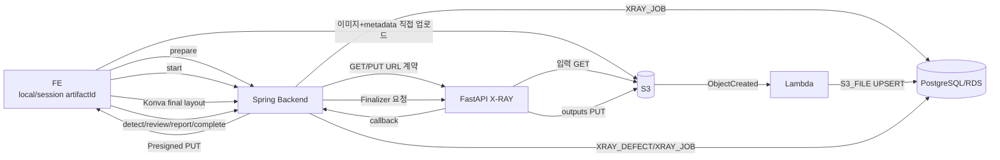

# X-RAY FE–BE–AWS A to Z 테스트 가이드

> 대상 브랜치: `feature/xray-s3-rds-final-test` 또는 후속 정렬 브랜치  
> 로컬 환경: Windows PowerShell + Docker Desktop  
> AWS Region: `ap-northeast-2`

---

## 1. 팀원에게 전달할 AWS 정보

### 공유 가능한 값

```dotenv
AWS_REGION=ap-northeast-2
AWS_S3_BUCKET=bigproject09-xray-test-428270342381
```

```text
VPC: xray-test-vpc
S3 Bucket: bigproject09-xray-test-428270342381
S3 Prefix: xray/
Lambda: xray-s3-file-recorder
CloudWatch Log Group: /aws/lambda/xray-s3-file-recorder
RDS Identifier: xray-test-postgres
RDS Endpoint: xray-test-postgres.cvgoo0sw0y1u.ap-northeast-2.rds.amazonaws.com
RDS DB/User: conservation
Lambda SG: xray-test-sg-lambda
RDS SG: xray-test-sg-rds
```

### 별도 보안 전달 값

```dotenv
AWS_ACCESS_KEY_ID=<개별 자격증명>
AWS_SECRET_ACCESS_KEY=<개별 자격증명>
SPRING_DATASOURCE_PASSWORD=<DB 비밀번호>
XRAY_STITCH_CALLBACK_TOKEN=<사용 시 동일 값>
```

아래는 GitHub, PR, 일반 팀 채팅에 붙여넣지 않는다.

- `.env` 전체
- Secret Access Key
- RDS 비밀번호
- Presigned URL 전체
- callback token

EKS에서는 Access Key를 환경변수로 배포하지 않고 IAM Role/IRSA를 사용한다.

---

## 2. `.env` 준비

```powershell
Copy-Item .env.example .env
notepad .env
```

최소 확인값:

```dotenv
AWS_REGION=ap-northeast-2
AWS_S3_BUCKET=bigproject09-xray-test-428270342381
AWS_ACCESS_KEY_ID=<보안 전달값>
AWS_SECRET_ACCESS_KEY=<보안 전달값>
XRAY_STITCH_CALLBACK_URL=http://conservation-backend:8080/api/xray/stitch/callback
```

Git 제외 확인:

```powershell
git ls-files .env
git check-ignore .env
```

정상:

- 첫 명령: 출력 없음
- 둘째 명령: `.env` 출력

---

## 3. DB 스키마 정렬

신규 로컬 DB는 Hibernate가 테이블을 생성할 수 있지만, 기존 `xray_job`/`s3_file`이 있는 DB는 아래 migration을 먼저 적용한다.

```text
db/xray_workflow_alignment_migration.sql
```

적용 전 필수:

1. RDS snapshot 또는 DB 백업
2. `xray_job.artifact_id` 중복 여부 확인
3. 테스트 DB에서 migration 선실행

이 migration은 기존 상태를 다음처럼 변환한다.

```text
PENDING     → PREPARED
RUNNING     → STITCHING
COMPLETED   → STITCHED
FINALIZING  → STITCHED
FINALIZED   → STITCHED
FAILED      → FAILED
```

기존 `completed_at`은 자동 결합 완료 시각이었으므로 전체 X-RAY 완료 시각과 혼동되지 않도록 초기화한다. 이전 입력 컬럼은 첫 배포에서 rollback용으로 남기며 애플리케이션에서는 더 이상 읽지 않는다.

### Lambda Role 추가 권한

신규 Lambda 코드는 S3 metadata를 읽기 위해 `head_object`를 호출한다. Lambda 실행 Role에 대상 버킷 `xray/*`의 `s3:GetObject` 권한이 필요하다. S3 trigger 연결만으로 이 읽기 권한이 자동 부여되지는 않는다.

---

## 4. 테스트 이미지 준비

```text
C:\xray-test\
├─ color-reference.jpg
├─ xray-piece-01.jpg
└─ xray-piece-02.jpg
```

조건:

- 컬러 이미지 1개
- 서로 다른 X-RAY 원본 조각 2개 이상
- JPG/PNG 권장
- 영문·숫자·하이픈 파일명 권장
- 동일 이미지를 반복 업로드하면 AWS 연결만 확인 가능하며 결합 검증에는 부적합

---

## 5. Docker 실행

```powershell
docker compose down
docker compose build
docker compose up -d
docker compose ps
```

캐시 문제 시:

```powershell
docker compose down
docker compose build --no-cache
docker compose up -d
```

로그:

```powershell
docker compose logs --tail=150 conservation-backend
docker compose logs --tail=150 xray-ai
docker compose logs --tail=100 postgres
```

Health:

```powershell
Invoke-RestMethod http://localhost:8001/health | ConvertTo-Json -Depth 10
Invoke-RestMethod http://localhost:8080/api/xray/health | ConvertTo-Json -Depth 10
```

---

## 6. 1단계: Prepare

```powershell
$artifactId = [guid]::NewGuid().ToString()

$colorFile = "C:\xray-test\color-reference.jpg"
$xrayFile1 = "C:\xray-test\xray-piece-01.jpg"
$xrayFile2 = "C:\xray-test\xray-piece-02.jpg"

$prepareBody = @{
    artifactId = $artifactId
    colorFileName = [System.IO.Path]::GetFileName($colorFile)
    xrayFileNames = @(
        [System.IO.Path]::GetFileName($xrayFile1),
        [System.IO.Path]::GetFileName($xrayFile2)
    )
} | ConvertTo-Json

$prepare = Invoke-RestMethod `
    -Method Post `
    -Uri "http://localhost:8080/api/xray/stitch/jobs/prepare" `
    -ContentType "application/json" `
    -Body $prepareBody

$prepare | ConvertTo-Json -Depth 10
```

확인:

- `status = PREPARED`
- `jobId`, `artifactId`
- 각 파일의 `uploadUrl`
- 각 파일의 `uploadHeaders`
- X-RAY의 `x-amz-meta-source_order`가 0, 1 순서인지

---

## 7. 2단계: metadata 포함 S3 업로드

Presigned URL에 metadata가 서명되어 있으므로 `uploadHeaders`를 반드시 전송한다.

```powershell
$colorHeaders = @{}
$prepare.color.uploadHeaders.PSObject.Properties |
    ForEach-Object { $colorHeaders[$_.Name] = [string]$_.Value }

$xrayHeaders1 = @{}
$prepare.xrays[0].uploadHeaders.PSObject.Properties |
    ForEach-Object { $xrayHeaders1[$_.Name] = [string]$_.Value }

$xrayHeaders2 = @{}
$prepare.xrays[1].uploadHeaders.PSObject.Properties |
    ForEach-Object { $xrayHeaders2[$_.Name] = [string]$_.Value }

$colorUpload = Invoke-WebRequest `
    -Method Put `
    -Uri $prepare.color.uploadUrl `
    -Headers $colorHeaders `
    -InFile $colorFile `
    -UseBasicParsing

$xrayUpload1 = Invoke-WebRequest `
    -Method Put `
    -Uri $prepare.xrays[0].uploadUrl `
    -Headers $xrayHeaders1 `
    -InFile $xrayFile1 `
    -UseBasicParsing

$xrayUpload2 = Invoke-WebRequest `
    -Method Put `
    -Uri $prepare.xrays[1].uploadUrl `
    -Headers $xrayHeaders2 `
    -InFile $xrayFile2 `
    -UseBasicParsing

$colorUpload.StatusCode
$xrayUpload1.StatusCode
$xrayUpload2.StatusCode
```

정상:

```text
200
200
200
```

S3 확인:

```text
xray/{artifactId}/inputs/color/color-reference.jpg
xray/{artifactId}/inputs/xray/xray-piece-01.jpg
xray/{artifactId}/inputs/xray/xray-piece-02.jpg
```

---

## 8. 3단계: Lambda → S3_FILE 확인

AWS Console:

```text
Lambda
→ xray-s3-file-recorder
→ Monitor
→ View CloudWatch logs
```

확인:

- `processed` 증가
- `errors = []`
- folder marker ignored
- RDS 연결 성공

RDS 확인 쿼리:

```sql
SELECT
    artifact_id,
    usage_name,
    source_order,
    original_name,
    s3_key,
    status,
    created_at
FROM public.s3_file
WHERE artifact_id = '<artifactId>'
ORDER BY usage_name, source_order NULLS FIRST;
```

예상:

```text
color_reference / source_order NULL
xray_original / source_order 0
xray_original / source_order 1
```

RDS는 Private Subnet이므로 팀의 SSM/Bastion/EKS Pod 등 허용된 접속 경로를 사용한다.

---

## 9. 4단계: 자동 결합 Start

```powershell
$startBody = @{
    colorFileName = $prepare.color.fileName
    xrayFileNames = @(
        $prepare.xrays[0].fileName,
        $prepare.xrays[1].fileName
    )
} | ConvertTo-Json

$start = Invoke-RestMethod `
    -Method Post `
    -Uri "http://localhost:8080/api/xray/stitch/jobs/$($prepare.jobId)/start" `
    -ContentType "application/json" `
    -Body $startBody

$start | ConvertTo-Json -Depth 10
```

초기 상태:

```text
STITCHING
```

Polling:

```powershell
for ($i = 0; $i -lt 120; $i++) {
    $status = Invoke-RestMethod `
        -Uri "http://localhost:8080/api/xray/stitch/jobs/$($prepare.jobId)"

    Write-Host "$(Get-Date -Format HH:mm:ss) $($status.status) $($status.message)"

    if ($status.status -in @("STITCHED", "FAILED")) { break }
    Start-Sleep -Seconds 5
}

$status | ConvertTo-Json -Depth 10
```

자동 결합 성공 시 S3:

```text
outputs/assembled_xray.png
outputs/layout.json
outputs/report.json (선택)
outputs/layout_fragment_masks.zip
```

---

## 10. 5단계: 자동 결과 조회

```powershell
Invoke-WebRequest `
    -Uri "http://localhost:8080/api/xray/stitch/jobs/$($prepare.jobId)/result" `
    -OutFile ".\assembled-auto.png"

Invoke-RestMethod `
    -Uri "http://localhost:8080/api/xray/stitch/jobs/$($prepare.jobId)/layout" |
    ConvertTo-Json -Depth 100 |
    Set-Content ".\layout-auto.json" -Encoding UTF8
```

---

## 11. 6단계: Konva 최종 배치

실제 FE에서는 `layout.json`의 모든 fragment에 대해 최종 transform을 전송한다.

```http
PUT /api/xray/stitch/jobs/{jobId}/layout/final
```

처리 결과:

```text
layout.final.json
assembled_xray.final.png
source_owner.final.png
fragment_owner.final.png
seam_zone.final.png
overlap_mask.final.png
provenance.final.json
```

최종 배치 요청은 fragment identity와 transform 전체가 필요하므로 수동 PowerShell 테스트보다 FE/Konva 테스트를 권장한다.

---

## 12. 7단계: 결함 탐지·매핑

최종 배치가 끝난 후:

```powershell
$detectBody = @{ confidence = 0.08 } | ConvertTo-Json

$defects = Invoke-RestMethod `
    -Method Post `
    -Uri "http://localhost:8080/api/xray/jobs/$($prepare.jobId)/detect" `
    -ContentType "application/json" `
    -Body $detectBody

$defects | ConvertTo-Json -Depth 30
```

예상:

- 상태 `REVIEW_READY`
- `assembledFinalUrl`
- 결함별 `id`, `originType`, `geometry`, `reviewDecision=DAMAGE`

DB:

```sql
SELECT *
FROM public.xray_defect
WHERE xray_job_id = '<jobId>'
ORDER BY id;
```

---

## 13. 8단계: DAMAGE/NORMAL 검수

```powershell
$reviewBody = @{
    defects = @(
        @{
            id = $defects.defects[0].id
            reviewDecision = "NORMAL"
        }
    )
} | ConvertTo-Json -Depth 10

$reviewed = Invoke-RestMethod `
    -Method Put `
    -Uri "http://localhost:8080/api/xray/jobs/$($prepare.jobId)/defects" `
    -ContentType "application/json" `
    -Body $reviewBody

$reviewed | ConvertTo-Json -Depth 30
```

---

## 14. 9단계: 문안 생성·확정

OpenAI Key가 설정된 경우:

```powershell
$reportRequest = @{
    artifactType = "금속 유물"
    material = "금속"
    reportStyle = "summary"
} | ConvertTo-Json

$draft = Invoke-RestMethod `
    -Method Post `
    -Uri "http://localhost:8080/api/xray/jobs/$($prepare.jobId)/report-text/generate" `
    -ContentType "application/json" `
    -Body $reportRequest
```

전문가 수정 후 저장:

```powershell
$saveReportBody = @{
    reportText = $draft.reportText
} | ConvertTo-Json

Invoke-RestMethod `
    -Method Put `
    -Uri "http://localhost:8080/api/xray/jobs/$($prepare.jobId)/report-text" `
    -ContentType "application/json" `
    -Body $saveReportBody
```

---

## 15. 10단계: X-RAY 파트 완료

```powershell
$complete = Invoke-RestMethod `
    -Method Post `
    -Uri "http://localhost:8080/api/xray/jobs/$($prepare.jobId)/complete"

$complete | ConvertTo-Json -Depth 10
```

정상:

- `status = COMPLETED`
- S3 `outputs/defect_result.png`
- RDS `xray_job.report_text`, `completed_at`
- Lambda가 `defect_result`를 S3_FILE에 기록

---

## 16. 기존 FE 호환 테스트

```http
POST /api/xray/stitch/jobs
Content-Type: multipart/form-data
```

필드:

```text
artifactId: UUID
colorFiles: 1개
xrayFiles: 2개 이상
```

기존 FE는 Spring에 multipart로 보내고, Spring이 metadata를 포함해 S3에 업로드한 뒤 자동 결합을 시작한다.

`artifactId`는 임시로 local/session 값을 사용하되 반드시 UUID여야 한다.

```javascript
const artifactId = sessionArtifactId || crypto.randomUUID();
```

---

## 17. 전체 구조



---

## 18. 장애 확인

### S3 PUT 403

- `uploadHeaders` 누락
- Presigned URL 만료
- PC 시각 오류
- URL 손상
- 다른 Content-Type 강제 지정

### output PUT 400

수정 코드에서는 `http.client`가 자동 Host와 수동 Host를 중복 전송하던 부분을 제거했다. 재발 시 FastAPI 로그의 S3 응답 body를 확인한다.

```powershell
docker compose logs --since=20m xray-ai
```

### Lambda 기록 없음

- S3 trigger prefix `xray/`
- Lambda 호출/CloudWatch
- `head_object` IAM 권한
- Lambda VPC/SG
- RDS SG 5432 source = Lambda SG
- DB 환경변수

### callback 실패

```powershell
docker compose exec conservation-backend `
    sh -lc 'env | sort | grep XRAY_STITCH_CALLBACK'
```

권장:

```text
http://conservation-backend:8080/api/xray/stitch/callback
```

### Java 빌드

```powershell
.\gradlew.bat clean test
```

### Python 테스트

```powershell
Push-Location .\ai-services\xray-ai
python -m unittest discover -s tests -v
Pop-Location

Push-Location .\aws\lambda\xray-s3-file-recorder
python -m unittest discover -s tests -v
Pop-Location
```
