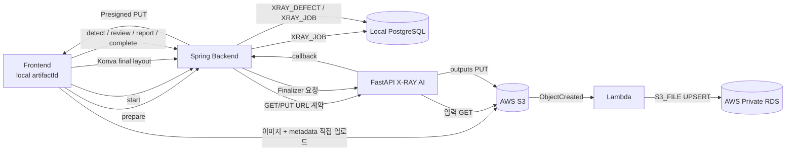

# X-RAY AWS 통합 구조 및 E2E 테스트 가이드

> 이 문서는 최신 FE/BE 코드를 받은 팀원이 로컬 Docker 환경에서 AWS S3·Lambda·RDS와 X-RAY 전체 Workflow를 처음부터 끝까지 재현하기 위한 실행 가이드입니다.
>
> 테스트 범위: 신규 유물 등록 → Presigned S3 업로드 → 자동 결합 → 수동 위치 보정 → Finalization → 결함 탐지 → 검수 → AI 상태조사 문안 → 최종 완료

---

## 0. 핵심 결정사항

- 서비스 기준 식별자는 `artifactId`입니다.
- X-RAY 내부 전체 업무 상태는 `jobId`로 추적합니다.
- `ARTIFACT : XRAY_JOB = 1 : 0..1` 정책을 적용합니다.
- 현재 Artifact API 통합 전이므로 FE의 local/session에서 전달하는 `artifactId(UUID)`를 사용합니다.
- 신규 local 유물의 `artifactId`는 반드시 UUID 형식이어야 합니다.
- 이미지·JSON·ZIP 산출물의 정본은 S3입니다.
- RDS에는 반복 조회·수정이 필요한 `XRAY_JOB`, `XRAY_DEFECT`, `S3_FILE`을 저장합니다.
- 최신 FE의 X-RAY 업로드 방식은 `prepare → Presigned PUT → start`입니다.
- 기존 multipart API는 호환용으로 유지하지만, 최신 FE 테스트에서는 Presigned 방식이 기준입니다.

---

# 1. 전체 구조



> ⚠️ **중요: 로컬 PostgreSQL과 AWS Private RDS는 서로 다른 DB입니다.**
>
> - 로컬 Docker Spring → 로컬 PostgreSQL을 사용할 수 있습니다.
> - Lambda → AWS Private RDS에 `S3_FILE`을 기록합니다.
> - 따라서 Lambda의 `s3_file` 저장 여부는 로컬 PostgreSQL이 아니라 AWS RDS에서 확인해야 합니다.

---

# 2. 주요 데이터 구조

## XRAY_JOB

유물 하나에 대한 X-RAY 전체 업무 상태를 관리합니다.

```text
PREPARED
→ STITCHING
→ STITCHED
→ DETECTING
→ REVIEW_READY
→ COMPLETED
```

실패 시 `FAILED` 상태를 사용합니다.

주요 컬럼:

| 컬럼 | 설명 |
|---|---|
| `id` | API에서 사용하는 `jobId` |
| `artifact_id` | FE에서 전달받는 유물 UUID |
| `status` | X-RAY 전체 업무 상태 |
| `report_text` | 최종 상태조사 문안 |
| `expected_color_count` | 예상 컬러 이미지 수 |
| `expected_xray_count` | 예상 X-RAY 원본 수 |
| `completed_at` | 전체 X-RAY 완료 시각 |

## XRAY_DEFECT

최종 결함 한 건당 한 행을 저장합니다.

`origin_type`:

```text
MATCHED
SOURCE_ONLY
ASSEMBLED_ONLY
```

`review_decision`:

```text
DAMAGE
NORMAL
```

기본값은 `DAMAGE`이며, 사용자는 정상으로 판단되는 오탐만 `NORMAL`로 제외합니다.

## S3_FILE

S3 Object metadata를 Lambda가 AWS RDS에 기록합니다.

주요 usage:

| usage_name | 실제 파일 |
|---|---|
| `color_reference` | `inputs/color/*` |
| `xray_original` | `inputs/xray/*` |
| `assembled_auto` | `assembled_xray.png` |
| `layout_auto` | `layout.json` |
| `layout_fragment_masks` | `layout_fragment_masks.zip` |
| `layout_final` | `layout.final.json` |
| `assembled_final` | `assembled_xray.final.png` |
| `source_owner` | `source_owner.final.png` |
| `fragment_owner` | `fragment_owner.final.png` |
| `seam_zone` | `seam_zone.final.png` |
| `overlap_mask` | `overlap_mask.final.png` |
| `provenance` | `provenance.final.json` |
| `defect_result` | `defect_result.png` |
| `report_json` | `report.json` |

---

# 3. 주요 API

## Stitch / Finalization

| Method | Path | 설명 |
|---|---|---|
| POST | `/api/xray/stitch/jobs/prepare` | Job 생성/재사용 + Presigned PUT URL 발급 |
| POST | `/api/xray/stitch/jobs/{jobId}/start` | 자동 결합 시작 |
| GET | `/api/xray/stitch/jobs/{jobId}` | Job 상태 polling |
| GET | `/api/xray/stitch/jobs/{jobId}/result` | 자동 결합 이미지 조회 |
| GET | `/api/xray/stitch/jobs/{jobId}/layout` | 자동 layout 조회 |
| PUT | `/api/xray/stitch/jobs/{jobId}/layout/final` | 최종 transform 저장 + Finalizer 실행 |
| GET | `/api/xray/stitch/jobs/{jobId}/result/final` | 최종 결합 이미지 조회 |
| POST | `/api/xray/stitch/callback` | FastAPI 내부 callback |

## Defect / Report / Complete

| Method | Path | 설명 |
|---|---|---|
| POST | `/api/xray/jobs/{jobId}/detect` | 원본+결합본 탐지 / 매핑 / XRAY_DEFECT 생성 |
| GET | `/api/xray/jobs/{jobId}/defects` | 최종 이미지 URL + 결함 조회 |
| PUT | `/api/xray/jobs/{jobId}/defects` | DAMAGE / NORMAL 검수 저장 |
| POST | `/api/xray/jobs/{jobId}/report-text/generate` | DAMAGE 기준 AI 문안 생성 |
| GET | `/api/xray/jobs/{jobId}/report-text` | 저장 문안 조회 |
| PUT | `/api/xray/jobs/{jobId}/report-text` | 최종 문안 저장 |
| POST | `/api/xray/jobs/{jobId}/complete` | `defect_result.png` 생성 + COMPLETED |

---

# 4. 팀원에게 전달받아야 하는 값

공유 가능한 값:

```dotenv
AWS_REGION=ap-northeast-2
AWS_S3_BUCKET=bigproject09-xray-test-428270342381
```

```text
VPC: xray-test-vpc
S3 Prefix: xray/
Lambda: xray-s3-file-recorder
CloudWatch Log Group: /aws/lambda/xray-s3-file-recorder
RDS Identifier: xray-test-postgres
RDS DB/User: conservation
```

별도 보안 전달:

```dotenv
AWS_ACCESS_KEY_ID=<개별 자격증명>
AWS_SECRET_ACCESS_KEY=<개별 자격증명>
SPRING_DATASOURCE_PASSWORD=<DB 비밀번호>
XRAY_STITCH_CALLBACK_TOKEN=<사용 시 동일 값>
```

다음 값은 GitHub/PR/일반 팀 채팅에 공유하지 않습니다.

- `.env` 전체
- Secret Access Key
- RDS 비밀번호
- Presigned URL 전체
- callback token

EKS 배포에서는 Access Key 환경변수 대신 IAM Role/IRSA 사용을 권장합니다.

---

# 5. 최신 코드 받기

## BE

**PC PowerShell — BE 프로젝트 폴더에서 입력**

```powershell
git switch <테스트할-BE-브랜치>
git pull
```

## FE

**PC PowerShell — FE 프로젝트 폴더에서 입력**

```powershell
git switch <테스트할-FE-브랜치>
git pull
```

최신 FE의 유물 저장 모드는 현재 다음 값을 유지합니다.

```dotenv
VITE_ARTIFACT_STORAGE_MODE=local
```

유물 자체는 local 방식으로 유지하지만, **X-RAY 이미지 업로드와 처리 Workflow는 AWS S3 기반**으로 동작합니다.

---

# 6. BE `.env` 준비

**PC PowerShell — BE 프로젝트 폴더에서 입력**

```powershell
Copy-Item .env.example .env
notepad .env
```

최소 확인값:

```dotenv
AWS_REGION=ap-northeast-2
AWS_S3_BUCKET=bigproject09-xray-test-428270342381
AWS_ACCESS_KEY_ID=<보안 전달값>
AWS_SECRET_ACCESS_KEY=<보안 전달값>
XRAY_STITCH_CALLBACK_URL=http://conservation-backend:8080/api/xray/stitch/callback
```

`.env` Git 제외 확인:

```powershell
git ls-files .env
git check-ignore .env
```

정상:

```text
첫 명령: 출력 없음
둘째 명령: .env 출력
```

---

# 7. DB Migration 확인

기존 DB에 `xray_job`, `s3_file` 등이 이미 존재한다면 다음 migration을 먼저 검토합니다.

```text
db/xray_workflow_alignment_migration.sql
```

적용 전:

1. DB 백업 또는 RDS Snapshot
2. `xray_job.artifact_id` 중복 여부 확인
3. 테스트 DB에서 선실행

기존 상태 변환:

```text
PENDING     → PREPARED
RUNNING     → STITCHING
COMPLETED   → STITCHED
FINALIZING  → STITCHED
FINALIZED   → STITCHED
FAILED      → FAILED
```

---

# 8. Docker 실행

**PC PowerShell — BE 프로젝트 폴더에서 입력**

```powershell
docker compose down
docker compose build
docker compose up -d
docker compose ps
```

캐시 문제 시:

```powershell
docker compose down
docker compose build --no-cache
docker compose up -d
```

로그:

```powershell
docker compose logs --tail=150 conservation-backend
docker compose logs --tail=150 xray-ai
docker compose logs --tail=100 postgres
```

Health:

```powershell
Invoke-RestMethod http://localhost:8001/health | ConvertTo-Json -Depth 10
Invoke-RestMethod http://localhost:8080/api/xray/health | ConvertTo-Json -Depth 10
```

정상 기준:

```text
Spring 정상 응답
FastAPI healthy
modelLoaded = true
```

---

# 9. 테스트 이미지 준비

예시:

```text
C:\xray-test\
├─ color-reference.jpg
├─ xray-piece-01.jpg
└─ xray-piece-02.jpg
```

조건:

- 컬러 이미지 1개
- 서로 다른 X-RAY 원본 조각 2개 이상
- JPG/PNG 권장
- 영문·숫자·하이픈 파일명 권장

---

# 10. Backend 단독 테스트 — Prepare

**PC PowerShell — BE 실행 상태에서 입력**

```powershell
$artifactId = [guid]::NewGuid().ToString()

$colorFile = "C:\xray-test\color-reference.jpg"
$xrayFile1 = "C:\xray-test\xray-piece-01.jpg"
$xrayFile2 = "C:\xray-test\xray-piece-02.jpg"

$prepareBody = @{
    artifactId = $artifactId
    colorFileName = [System.IO.Path]::GetFileName($colorFile)
    xrayFileNames = @(
        [System.IO.Path]::GetFileName($xrayFile1),
        [System.IO.Path]::GetFileName($xrayFile2)
    )
} | ConvertTo-Json

$prepare = Invoke-RestMethod `
    -Method Post `
    -Uri "http://localhost:8080/api/xray/stitch/jobs/prepare" `
    -ContentType "application/json" `
    -Body $prepareBody

$prepare | ConvertTo-Json -Depth 10
```

확인:

- `status = PREPARED`
- `jobId`
- `artifactId`
- `color.uploadUrl`
- `xrays[].uploadUrl`
- metadata 헤더 정보

> 최신 구현에서 응답의 헤더 필드명이 `requiredHeaders`로 내려오는 경우 FE는 이를 포함해 PUT해야 합니다. 과거 문서의 `uploadHeaders` 표기와 혼용될 수 있으므로 실제 `/prepare` 응답을 기준으로 확인합니다.

---

# 11. Presigned URL로 S3 업로드

Presigned URL은 Spring이 서명한 헤더만 사용합니다. **임의의 `Content-Type` 헤더를 추가하지 않습니다.**

실제 `/prepare` 응답의 헤더 필드가 `requiredHeaders`인 경우:

```powershell
$colorHeaders = @{}
$prepare.color.requiredHeaders.PSObject.Properties |
    ForEach-Object { $colorHeaders[$_.Name] = [string]$_.Value }

$xrayHeaders1 = @{}
$prepare.xrays[0].requiredHeaders.PSObject.Properties |
    ForEach-Object { $xrayHeaders1[$_.Name] = [string]$_.Value }

$xrayHeaders2 = @{}
$prepare.xrays[1].requiredHeaders.PSObject.Properties |
    ForEach-Object { $xrayHeaders2[$_.Name] = [string]$_.Value }
```

그 다음 PUT:

```powershell
$colorUpload = Invoke-WebRequest `
    -Method Put `
    -Uri $prepare.color.uploadUrl `
    -Headers $colorHeaders `
    -InFile $colorFile `
    -UseBasicParsing

$xrayUpload1 = Invoke-WebRequest `
    -Method Put `
    -Uri $prepare.xrays[0].uploadUrl `
    -Headers $xrayHeaders1 `
    -InFile $xrayFile1 `
    -UseBasicParsing

$xrayUpload2 = Invoke-WebRequest `
    -Method Put `
    -Uri $prepare.xrays[1].uploadUrl `
    -Headers $xrayHeaders2 `
    -InFile $xrayFile2 `
    -UseBasicParsing

$colorUpload.StatusCode
$xrayUpload1.StatusCode
$xrayUpload2.StatusCode
```

정상:

```text
200
200
200
```

S3 예상 경로:

```text
xray/{artifactId}/inputs/color/...
xray/{artifactId}/inputs/xray/...
```

---

# 12. Lambda → AWS RDS 확인

## AWS Console

```text
AWS Console
→ Lambda
→ xray-s3-file-recorder
→ Monitor
→ View CloudWatch logs
→ 최신 Log Stream
```

확인:

- `processed` 증가
- `errors = []`
- 해당 `artifactId` 처리 확인
- metadata parsing 확인

## AWS RDS

Private RDS이므로 허용된 접속 경로(VPC CloudShell / SSM / Bastion / EKS Pod 등)를 사용합니다.

```sql
SELECT
    artifact_id,
    usage_name,
    source_order,
    original_name,
    s3_key,
    status,
    created_at
FROM public.s3_file
WHERE artifact_id = '<artifactId>'
ORDER BY usage_name, source_order NULLS FIRST;
```

예상:

```text
color_reference / source_order NULL
xray_original / source_order 0
xray_original / source_order 1
```

---

# 13. 자동 결합 Start

**PC PowerShell — BE 실행 상태에서 입력**

```powershell
$startBody = @{
    colorFileName = $prepare.color.fileName
    xrayFileNames = @(
        $prepare.xrays[0].fileName,
        $prepare.xrays[1].fileName
    )
} | ConvertTo-Json

$start = Invoke-RestMethod `
    -Method Post `
    -Uri "http://localhost:8080/api/xray/stitch/jobs/$($prepare.jobId)/start" `
    -ContentType "application/json" `
    -Body $startBody

$start | ConvertTo-Json -Depth 10
```

초기 상태:

```text
STITCHING
```

Polling:

```powershell
for ($i = 0; $i -lt 120; $i++) {
    $status = Invoke-RestMethod `
        -Uri "http://localhost:8080/api/xray/stitch/jobs/$($prepare.jobId)"

    Write-Host "$(Get-Date -Format HH:mm:ss) $($status.status) $($status.message)"

    if ($status.status -in @("STITCHED", "FAILED")) { break }
    Start-Sleep -Seconds 5
}

$status | ConvertTo-Json -Depth 10
```

정상 성공 시 S3 outputs:

```text
assembled_xray.png
layout.json
layout_fragment_masks.zip
report.json    # 생성되는 경우
```

---

# 14. 자동 결과 조회

**PC PowerShell — BE 프로젝트 폴더에서 입력**

```powershell
Invoke-WebRequest `
    -Uri "http://localhost:8080/api/xray/stitch/jobs/$($prepare.jobId)/result" `
    -OutFile ".\assembled-auto.png"

Invoke-RestMethod `
    -Uri "http://localhost:8080/api/xray/stitch/jobs/$($prepare.jobId)/layout" |
    ConvertTo-Json -Depth 100 |
    Set-Content ".\layout-auto.json" -Encoding UTF8
```

이 파일들은 로컬 테스트 산출물이며 Git에 커밋하지 않습니다.

---

# 15. 수동 위치 보정 / Finalization

실제 FE에서는 `layout.json`을 기반으로 Konva에서 모든 fragment의 최종 transform을 전송합니다.

```http
PUT /api/xray/stitch/jobs/{jobId}/layout/final
```

정상 결과:

```text
layout.final.json
assembled_xray.final.png
source_owner.final.png
fragment_owner.final.png
seam_zone.final.png
overlap_mask.final.png
provenance.final.json
```

> 이 단계는 fragment identity와 전체 transform이 필요하므로 PowerShell 수동 입력보다 최신 FE를 통한 테스트를 권장합니다.

---

# 16. 결함 탐지 / Mapping

Finalization 완료 후:

**PC PowerShell — BE 실행 상태에서 입력**

```powershell
$detectBody = @{ confidence = 0.08 } | ConvertTo-Json

$defects = Invoke-RestMethod `
    -Method Post `
    -Uri "http://localhost:8080/api/xray/jobs/$($prepare.jobId)/detect" `
    -ContentType "application/json" `
    -Body $detectBody

$defects | ConvertTo-Json -Depth 30
```

정상 기준:

```text
status = REVIEW_READY
assembledFinalUrl 존재
결함별 reviewDecision = DAMAGE
```

로컬 Spring DB 확인 예시:

```sql
SELECT *
FROM public.xray_defect
WHERE xray_job_id = '<jobId>'
ORDER BY id;
```

---

# 17. DAMAGE / NORMAL 검수

예시:

```powershell
$reviewBody = @{
    defects = @(
        @{
            id = $defects.defects[0].id
            reviewDecision = "NORMAL"
        }
    )
} | ConvertTo-Json -Depth 10

$reviewed = Invoke-RestMethod `
    -Method Put `
    -Uri "http://localhost:8080/api/xray/jobs/$($prepare.jobId)/defects" `
    -ContentType "application/json" `
    -Body $reviewBody

$reviewed | ConvertTo-Json -Depth 30
```

기본 정책:

```text
모든 탐지 후보 = DAMAGE
정상으로 판단한 후보만 NORMAL로 제외
```

---

# 18. AI 상태조사 문안 생성 / 저장

OpenAI Key가 설정된 경우:

```powershell
$reportRequest = @{
    artifactType = "금속 유물"
    material = "금속"
    reportStyle = "summary"
} | ConvertTo-Json

$draft = Invoke-RestMethod `
    -Method Post `
    -Uri "http://localhost:8080/api/xray/jobs/$($prepare.jobId)/report-text/generate" `
    -ContentType "application/json" `
    -Body $reportRequest

$draft | ConvertTo-Json -Depth 10
```

저장:

```powershell
$saveReportBody = @{
    reportText = $draft.reportText
} | ConvertTo-Json

Invoke-RestMethod `
    -Method Put `
    -Uri "http://localhost:8080/api/xray/jobs/$($prepare.jobId)/report-text" `
    -ContentType "application/json" `
    -Body $saveReportBody
```

한글 문안은 UTF-8로 정상 반환되어야 합니다.

---

# 19. Complete

**PC PowerShell — BE 실행 상태에서 입력**

```powershell
$complete = Invoke-RestMethod `
    -Method Post `
    -Uri "http://localhost:8080/api/xray/jobs/$($prepare.jobId)/complete"

$complete | ConvertTo-Json -Depth 10
```

정상 기준:

```text
status = COMPLETED
errorMessage = null
```

S3:

```text
outputs/defect_result.png
```

---

# 20. 최신 Frontend 포함 전체 E2E 테스트

Backend 단독 테스트가 정상이라면 최신 FE에서 실제 사용자 흐름을 확인합니다.

현재 FE 설정:

```dotenv
VITE_ARTIFACT_STORAGE_MODE=local
```

유물 정보 저장은 local로 유지하지만 X-RAY는 AWS S3 Workflow를 사용합니다.

신규 local 유물의 `artifactId`는 UUID여야 합니다.

예시:

```javascript
crypto.randomUUID()
```

실제 진행 순서:

```text
신규 유물 등록
→ X-RAY 진입
→ 컬러 이미지 선택
→ X-RAY 조각 선택
→ /prepare
→ Presigned S3 PUT
→ /start
→ 자동 결합
→ 수동 위치 보정
→ Finalization
→ 결함 탐지
→ 정상 후보 제외
→ AI 상태조사 문안 생성
→ 최종 완료
```

브라우저 DevTools Network에서 확인할 주요 요청:

```text
POST /api/xray/stitch/jobs/prepare
POST /api/xray/stitch/jobs/{jobId}/start
PUT  /api/xray/stitch/jobs/{jobId}/layout/final
POST /api/xray/jobs/{jobId}/detect
PUT  /api/xray/jobs/{jobId}/defects
POST /api/xray/jobs/{jobId}/report-text/generate
PUT  /api/xray/jobs/{jobId}/report-text
POST /api/xray/jobs/{jobId}/complete
```

최종 성공 기준:

```text
Spring Job status = COMPLETED
errorMessage = null
S3 outputs/defect_result.png 존재
```

---

# 21. S3 최종 산출물 확인

AWS Console:

```text
S3
→ bigproject09-xray-test-428270342381
→ xray
→ {artifactId}
```

최종적으로 확인할 파일:

```text
inputs/color/...
inputs/xray/...

outputs/assembled_xray.png
outputs/layout.json
outputs/layout_fragment_masks.zip
outputs/layout.final.json
outputs/assembled_xray.final.png
outputs/source_owner.final.png
outputs/fragment_owner.final.png
outputs/seam_zone.final.png
outputs/overlap_mask.final.png
outputs/provenance.final.json
outputs/defect_result.png
```

---

# 22. 최종 Job 상태 확인

**PC PowerShell — BE 실행 상태에서 입력**

```powershell
$jobId = "<테스트-jobId>"

Invoke-RestMethod `
  -Method Get `
  -Uri "http://localhost:8080/api/xray/stitch/jobs/$jobId" |
ConvertTo-Json -Depth 10
```

정상:

```json
{
  "status": "COMPLETED",
  "message": "X-ray inspection is complete.",
  "errorMessage": null
}
```

---

# 23. 장애 대응

## Presigned S3 PUT 403

확인:

- Presigned URL 만료
- URL이 복사 과정에서 손상되었는지
- 서명된 metadata header 누락
- PC 시각 오류
- 임의 `Content-Type` 추가 여부

원칙:

> `/prepare`가 내려준 서명 대상 헤더만 그대로 전송합니다.

## FastAPI output PUT 400

FastAPI 로그 확인:

```powershell
docker compose logs --since=20m xray-ai
```

과거에는 수동 `Host` 헤더와 `http.client` 자동 Host가 중복되어 S3 400이 발생한 적이 있으므로 재발 시 Request Header를 확인합니다.

## Lambda 기록 없음

확인 순서:

```text
S3 trigger prefix = xray/
→ Lambda 실행 여부
→ CloudWatch 로그
→ Lambda Role s3:GetObject 권한
→ Lambda VPC / Subnet / SG
→ RDS SG 5432 Source = Lambda SG
→ DB 환경변수
```

## callback 실패

**PC PowerShell — BE 프로젝트 폴더에서 입력**

```powershell
docker compose exec conservation-backend `
    sh -lc 'env | sort | grep XRAY_STITCH_CALLBACK'
```

권장 내부 URL:

```text
http://conservation-backend:8080/api/xray/stitch/callback
```

## Java 빌드 확인

```powershell
.\gradlew.bat clean test
```

## Python 테스트

```powershell
Push-Location .\ai-services\xray-ai
python -m unittest discover -s tests -v
Pop-Location

Push-Location .\aws\lambda\xray-s3-file-recorder
python -m unittest discover -s tests -v
Pop-Location
```

---

# 24. 최종 성공 체크리스트

- [ ] 최신 BE 코드 pull
- [ ] 최신 FE 코드 pull
- [ ] BE `.env` 구성
- [ ] Spring 정상 실행
- [ ] FastAPI 정상 실행
- [ ] `/api/xray/health` 정상
- [ ] FastAPI `/health` 정상
- [ ] `/prepare` 성공
- [ ] Presigned URL 발급 성공
- [ ] 컬러 이미지 S3 업로드 성공
- [ ] X-RAY 원본 S3 업로드 성공
- [ ] Lambda 실행 확인
- [ ] AWS RDS `s3_file` 저장 확인
- [ ] `/start` 성공
- [ ] 자동 결합 성공
- [ ] `assembled_xray.png` 생성
- [ ] `layout.json` 생성
- [ ] `layout_fragment_masks.zip` 생성
- [ ] 수동 위치 보정 성공
- [ ] Finalization 성공
- [ ] `assembled_xray.final.png` 생성
- [ ] 결함 탐지 성공
- [ ] `XRAY_DEFECT` 생성 확인
- [ ] DAMAGE / NORMAL 검수 성공
- [ ] AI 상태조사 문안 생성 성공
- [ ] 문안 저장 성공
- [ ] `/complete` 성공
- [ ] `defect_result.png` 생성
- [ ] Job `COMPLETED`
- [ ] 최신 FE에서 동일 Workflow 성공

---

# 25. EKS 배포 시 추가 확인

로컬 전체 E2E가 성공한 뒤 EKS에서는 다음을 추가 확인합니다.

- Spring Pod → S3 접근 권한
- FastAPI Pod → S3 접근 권한
- EKS에서는 장기 Access Key 대신 IAM Role / IRSA 사용
- callback URL이 Kubernetes Service DNS 기준으로 설정되어 있는지
- RDS Security Group 및 Network 경로
- 환경변수 / Secret 주입
- FE 배포 환경의 Backend URL / CORS
- 동일 E2E Workflow 재검증

